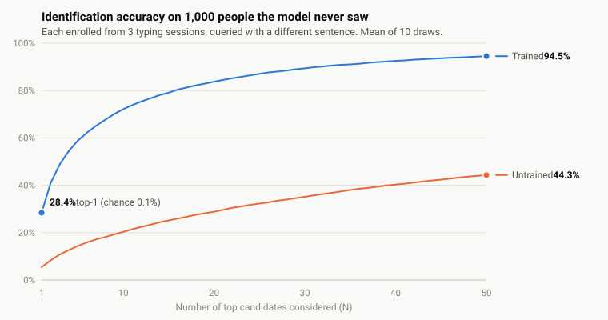

<div align="center">
  
  
  # TypeID: Keystroke Biometrics Identification
  
  *Open-set 1:N gallery search on typing rhythm*
</div>

[](https://www.python.org/)
[](https://pytorch.org/)
[](https://developer.nvidia.com/cuda-toolkit)
[](LICENSE)

A portfolio project exploring **open-set biometric identification from keystroke dynamics** — the typing-rhythm equivalent of a fingerprint or face-recognition search system. Given an unknown typing sample, identify the top-K most likely matches from a gallery of enrolled identities.

This is **not a classifier**. It's a 1:N gallery search built on a learned embedding space. A network is trained once, offline, on a public dataset to map keystroke sequences to vectors such that the same person's typing clusters together and different people's typing spreads apart. New people enroll later without retraining—enrollment and query are just a forward pass plus nearest-neighbor search.

Subjects prove identity by **transcribing a random on-screen sentence** they've never seen before (not free composition, not a fixed password). The sentence varies every session, which rules out fixed-position features but forces the model to learn subject-specific rhythm rather than content-specific timing.

## Results

<picture>
  <source media="(prefers-color-scheme: dark)" srcset="eval/cmc_dark.svg">
  
</picture>

A 500,000-step model (200k steps with random negatives, then 300k with **hard negative mining**) evaluated on **1,000 subjects held out of training entirely** — the split is by person, never by sample, so every identity here is one the network has never seen. Each is enrolled from 3 typing sessions and queried with a *different* sentence, so the model can't lean on what was typed. Figures are the mean ± standard deviation over 10 random draws of 1,000 subjects.

| | Rank-1 | Rank-5 | Rank-10 | Rank-20 |
|---|---|---|---|---|
| **Hardest-negative model (500k steps)** | **56.9% ± 1.7** | 84.6% ± 1.4 | 91.9% ± 0.7 | 96.1% ± 0.6 |
| Random-negative baseline (200k steps) | 28.4% ± 1.3 | 58.9% ± 1.4 | 72.2% ± 2.0 | 83.8% ± 1.0 |
| Untrained network | 5.4% | 14.4% | 20.4% | 28.8% |
| Chance | 0.1% | 0.5% | 1.0% | 2.0% |

Read Rank-20 as: the correct person is among the top 20 of 1,000 candidates 96% of the time. The untrained row is the one that matters for calibration — raw timing features carry some signal even through a randomly initialized network, so that, not chance, is the honest floor.

**With more data per person.** The test above is deliberately strict: one short query per person. The [TypeNet paper](https://arxiv.org/abs/2101.05570) reports identification with 10 enrollment and 5 query sequences per person, scored by mean pairwise distance, and gets 67.4% Rank-1 for its triplet model on a 1,000-person gallery. Under that same protocol:

| Rank-1, 1,000 people, 10 enroll + 5 query sessions | Pairwise distance (TypeNet's rule) | Averaged profile |
|---|---|---|
| Random-negative baseline (200k) | 65.2% | 82.4% |
| **Hardest-negative model (500k)** | **93.3%** | **98.0%** |

Those two columns sample 15 random sessions per person and pool every window of a session, so they are a little friendlier than the paper. `eval/typenet_protocol.py` follows the paper literally: each person's first 15 sequences in time order, first 10 as gallery and last 5 as query, **one 50-keystroke window per sequence**, mean pairwise distance, and EER for authentication (per person, then averaged). Ten random draws of 1,000 held-out people:

| Model | Rank-1 (1,000 people) | EER at 1 / 5 / 10 enrollment sequences |
|---|---|---|
| TypeNet, published (triplet, desktop, key code as input) | 67.4% | 5.4 / 2.2 / 1.6 |
| Random-negative baseline (200k) | 60.5% | 5.43 / 2.57 / 2.01 |
| Random-negative control (300k) | 61.8% | 5.35 / 2.56 / 1.97 |
| Semi-hard mining (300k) | 82.1% | 4.09 / 1.34 / 0.90 |
| Semi-hard mining (500k) | 85.2% | 3.48 / 1.04 / 0.73 |
| **Hardest-negative (500k)** | **89.8%** | **3.01 / 0.81 / 0.55** |
| Untrained network | 11.2% | 24.98 / 20.48 / 19.29 |

The random-negative baseline lands on TypeNet's published one-sequence EER (5.43% vs 5.4%), which is the check that this evaluation is like-for-like; it sits below their Rank-1, consistent with this model not seeing the key code. Mining is what moves it past the paper. Caveats: TypeNet tests on 100,000 people and this test can only use the 3,771 held-out people with 15 sessions above the 25-keystroke floor, so its galleries overlap across draws; giving the hardest-negative model a gallery of all 3,771 lowers Rank-1 from 89.8% to 79.0%. The same model scores 90.2% on people it *trained* on, so there is no memorization gap. Averaging a person's enrollment embeddings into one profile beats averaging pairwise distances, which is what the backend's pooling does.

**How it got here.** Accuracy plateaued at 28% after roughly 90k steps of random negatives, and a diagnostic showed why: 78% of randomly drawn training triplets already satisfied the loss margin and contributed no gradient. Replacing each random negative with a harder one from the same batch raised Rank-1 to 51.7% (semi-hard), and taking the closest negative regardless (hardest) to 56.9% at equal compute. A control that simply trained 100k more steps with random negatives gained 0.8 points, so the improvement comes from which negatives are used, not from training longer. The hardest-negative curve is now flattening.

Reproduce with `python -m eval.rank_n --seeds 0 1 2 3 4 5 6 7 8 9` (add `--enroll-sessions 10 --probe-sessions 5 --score pairwise` for the random-session TypeNet-style variant, or run `python -m eval.typenet_protocol --checkpoint model/encoder_hard.pt --seeds 0 1 2 3 4 5 6 7 8 9` for the strict one), or open [`eval/dashboard.html`](eval/dashboard.html) for the full project timeline and per-checkpoint curves.

## Why This Framing Matters

Keystroke biometrics is not a solved problem—particularly the generalization gap between transcription (controlled, read-then-copy) and free composition (spontaneous, think-then-type). This project validates the **embedding + ranking architecture** on a transcription proxy task. It's a real improvement over fixed-password datasets (forces generalization to unseen text, avoids memorizing one password's motor pattern) but carries a known domain gap against composed text. Composition capture and cross-device evaluation are the natural next steps. See [ARCHITECTURE.md](ARCHITECTURE.md) for the full technical design and [CLAUDE.md](CLAUDE.md) for how to contribute.

## Try it out

Enroll, then identify against the live gallery — from a phone or a second device works too, as
long as it can reach the backend on your local network.

**Backend** (FastAPI, from `backend/`):
```
python -m venv .venv
.venv\Scripts\activate
pip install -r requirements.txt
uvicorn app.main:app --reload
```
Serves on `http://127.0.0.1:8000`; `/health` should return `{"status": "ok"}`.

**Frontend** (Vite, from `frontend/`):
```
npm install
npm run dev
```
Serves on `http://localhost:5173`, CORS-allowed against the backend above.

## Current state vs. target

| Piece | Target (per [ARCHITECTURE.md](ARCHITECTURE.md)) | Current state |
|---|---|---|
| Feature extraction (`features/extract.py`) | Canonical HL/IL/PL/RL timing-vector extractor, shared byte-for-byte by training and live capture | **Done** — single implementation used by both paths, 12 unit tests, 25-keystroke floor enforced per window |
| Model (`/model`) | 2-layer LSTM triplet-loss embedding network, trained on Aalto | **Done** — 217k-parameter encoder trained 500k steps with hard negative mining; 56.9% Rank-1 on held-out subjects (see [Results](#results)) |
| Embedding function (`backend/app/embedding.py`) | Frozen `f(features) -> 128-dim embedding` | **Done** — loads the trained checkpoint, pools multi-window sessions, re-normalizes |
| Gallery store (`backend/app/gallery.py`) | SQLite table of `{person_id, name, embedding, enrolled_at}` | **Done** — implemented and working |
| `/enroll`, `/identify` endpoints | Full extract → embed → pool/rank flow | **Done** — both reachable and wired to the trained model |
| Embedding map (`GET /map`) | Interactive view of the gallery embedding space | **Done** — seeded Aalto background plus enrolled points |
| Frontend capture UI | Prompt display, capture, submit to backend, render top-5 results | **Done** — enroll and identify flows are wired to the backend, reachable from a phone |
| Evaluation (`/eval`) | CMC curve, Rank-N accuracy | **Done** — multi-seed Rank-N/CMC over held-out subjects, plus an HTML progress dashboard |
| Data (`/data`) | Cached preprocessed Aalto sequences | **Done** — 2.48M windows from 168,593 participants, cached as `.npy`; subject-disjoint split saved to `split.json` |

In short: the **system works end to end** — canonical feature extraction, a trained embedding
model, a live gallery reachable through `/enroll` and `/identify`, and a held-out evaluation that
says how well it performs. The open questions from here are free-text composition, explainability,
and data protection.

## How It Works

**Data:** Per-keystroke timing vectors (hold, inter-key, press, release latencies) extracted from keystroke events. Variable-length sequences, text-independent—the model learns typing rhythm, not what was typed.

**Model:** 2-layer LSTM encoder trained on triplet loss. Anchor and positive pairs are two different sessions from the same person (different transcribed text each time). Negatives are sessions from different people. The triplet loss pushes same-person embeddings close and different-people embeddings far.

**Training → Enrollment → Identification:**
1. Train the LSTM once on the [Aalto 136M Keystrokes dataset](https://userinterfaces.aalto.fi/136Mkeystrokes/) (public, 168,000 subjects, ~15 transcribed sentences each). Output: frozen embedding function `f()`.
2. User enrolls: transcribes 2–3 random prompts. Backend extracts timing features, runs through `f()`, stores embedding + name in gallery.
3. Unknown sample arrives. Extract timing, embed with `f()`, rank gallery by cosine similarity, return top-5 candidates.

**Critical invariant:** `features/extract.py` is the single canonical feature extractor used by both training and live endpoints. Any divergence between training features and query features introduces silent bugs—a model trained on slightly-different features degrades without error. See [ARCHITECTURE.md](ARCHITECTURE.md) for detailed feature and model specs.

## Repo Structure

```
/data/        Aalto loader, cache builder, subject-disjoint split (preprocessed arrays gitignored)
/features/    canonical feature-extraction module + unit tests
/model/       LSTM encoder, triplet loss, triplet sampler, training script (weights gitignored)
/eval/        Rank-N / CMC evaluation, progress dashboard
/backend/     FastAPI app: gallery store, /enroll, /identify, /map — all wired to the trained model
/frontend/    Vite + Tailwind capture UI, wired to the backend for enroll/identify

ARCHITECTURE.md  Full technical design: data specs, model, evaluation metrics
CLAUDE.md        Contribution guidelines and working conventions
```

See [ARCHITECTURE.md](ARCHITECTURE.md) for detailed feature extraction, model architecture, and evaluation methodology.

## References

**Primary dataset and architecture:**
- Dhakal, V., Feit, A. M., Kristensson, P. O., & Oulasvirta, A. (2018). [Observations on Typing from 136 Million Keystrokes](https://dl.acm.org/doi/10.1145/3173574.3174220). *CHI '18*. ([Free PDF](https://acris.aalto.fi/ws/portalfiles/portal/21495207/ELEC_Dhakal_et_al_Observations_CHI2018.pdf))
- [Aalto 136M Keystrokes dataset](https://userinterfaces.aalto.fi/136Mkeystrokes/) — download page for the dataset used to train this project's embedding model.
- Acien, A., Morales, A., Fierrez, J., & Висоцкий, R. (2021). [TypeNet: Deep Learning Keystroke Biometrics](https://arxiv.org/pdf/2101.05570). *arXiv*. — Reference LSTM embedding architecture and triplet-loss training for keystroke dynamics.

**Transcription-to-composition transfer (research direction):**
- Killourhy, K. S., & Maxion, R. A. (2012). [Free vs. Transcribed Text for Keystroke-Dynamics Evaluations](https://dl.acm.org/doi/10.1145/2379616.2379617). *LASER '12*. — Early analysis of domain gap between transcribed and freely-composed text; foundational for understanding generalization.
- Sun, L., Ceker, H., & Upadhyaya, S. (2016). [User Authentication with Keystroke Dynamics in Long-Text Data](https://cse.buffalo.edu/tech-reports/2016-07.pdf). *Buffalo Tech Report*. ([Dataset](https://www.researchgate.net/publication/312568278_Shared_keystroke_dataset_for_continuous_authentication)) — Mixed transcription and free-text from same subjects; best fit for measuring transcription→composition gap on modern architectures.

**Applications and extensions:**
- Park, J., Park, Y., & Jang, B. (2024). [LLM-Assisted Cheating Detection in Korean Language via Keystrokes](https://arxiv.org/html/2507.22956v1). *arXiv*. — Real-world application of keystroke dynamics to detect exam fraud; shows how timing features generalize across languages and high-cognitive-load scenarios.
