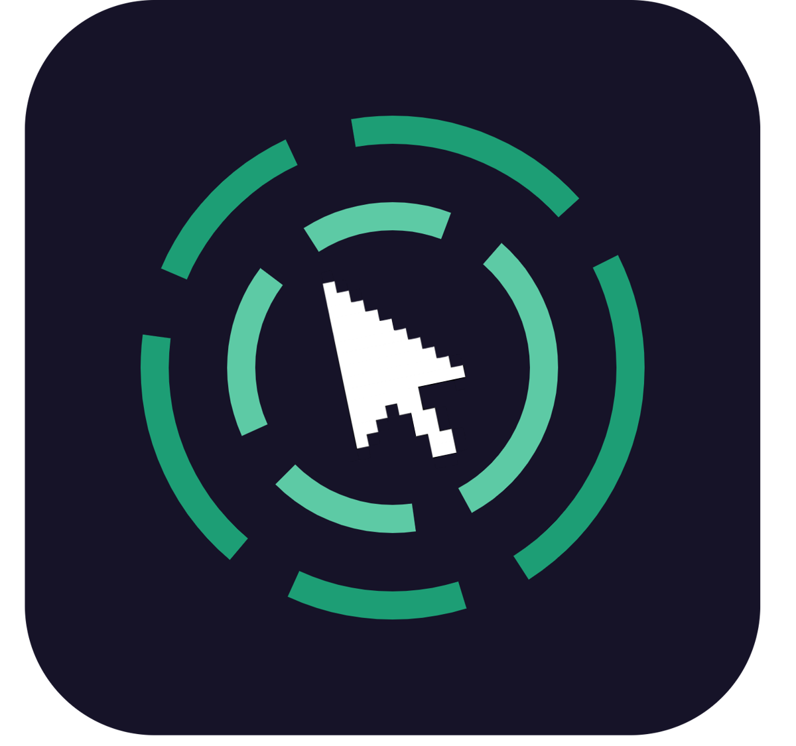

<div align="center">
  
  
  # TypeID: Keystroke Biometrics Identification
  
  *Open-set 1:N gallery search on typing rhythm*
</div>

[](https://www.python.org/)
[](https://pytorch.org/)
[](https://developer.nvidia.com/cuda-toolkit)
[](LICENSE)

A portfolio project exploring **open-set biometric identification from keystroke dynamics** — the typing-rhythm equivalent of a fingerprint or face-recognition search system. Given an unknown typing sample, identify the top-K most likely matches from a gallery of enrolled identities.

This is **not a classifier**. It's a 1:N gallery search built on a learned embedding space. A network is trained once, offline, on a public dataset to map keystroke sequences to vectors such that the same person's typing clusters together and different people's typing spreads apart. New people enroll later without retraining—enrollment and query are just a forward pass plus nearest-neighbor search.

Subjects prove identity by **transcribing a random on-screen sentence** they've never seen before (not free composition, not a fixed password). The sentence varies every session, which rules out fixed-position features but forces the model to learn subject-specific rhythm rather than content-specific timing.

## Why This Framing Matters

Keystroke biometrics is not a solved problem—particularly the generalization gap between transcription (controlled, read-then-copy) and free composition (spontaneous, think-then-type). This project validates the **embedding + ranking architecture** on a transcription proxy task. It's a real improvement over fixed-password datasets (forces generalization to unseen text, avoids memorizing one password's motor pattern) but carries a known domain gap against composed text. See [ARCHITECTURE.md](ARCHITECTURE.md) for the full technical design, [FUTURE_PROSPECTS.md](FUTURE_PROSPECTS.md) for next steps (composition capture, cross-device evaluation), and [CLAUDE.md](CLAUDE.md) for how to contribute.

## Try it out

The demo currently only shows the **capture UI** (type a prompt, see your dwell/flight-time
rhythm) — enrollment and identification against a live gallery aren't wired up yet (see
[Current state](#current-state-vs-target) below).

**Backend** (FastAPI, from `backend/`):
```
python -m venv .venv
.venv\Scripts\activate
pip install -r requirements.txt
uvicorn app.main:app --reload
```
Serves on `http://127.0.0.1:8000`; `/health` should return `{"status": "ok"}`.

**Frontend** (Vite, from `frontend/`):
```
npm install
npm run dev
```
Serves on `http://localhost:5173`, CORS-allowed against the backend above.

## Current state vs. target

| Piece | Target (per [ARCHITECTURE.md](ARCHITECTURE.md)) | Current state |
|---|---|---|
| Feature extraction (`features/extract.py`) | Canonical HL/IL/PL/RL timing-vector extractor, shared byte-for-byte by training and live capture | Stub — raises `NotImplementedError`; not yet built against real Aalto data |
| Model (`/model`) | 2-layer LSTM triplet-loss embedding network, trained on Aalto | Doesn't exist yet — no directory, no training script, no weights |
| Embedding function (`backend/app/embedding.py`) | Frozen `f(features) -> 128-dim embedding` | Stub — raises `NotImplementedError` until a trained model lands |
| Gallery store (`backend/app/gallery.py`) | SQLite table of `{person_id, name, embedding, enrolled_at}` | **Done** — implemented and working |
| `/enroll`, `/identify` endpoints | Full extract → embed → pool/rank flow | Routing, schemas, pooling, and ranking logic are fully written and correct, but unreachable — both endpoints return `501` until extraction/embedding are implemented |
| Frontend capture UI | Prompt display, capture, submit to backend, render top-5 results | Prompt display + capture + client-side rhythm visualization work; **not yet wired to the backend** (enroll/identify calls are a TODO) |
| Evaluation (`/eval`) | CMC curve, Rank-N accuracy | Doesn't exist yet — depends on a trained model |
| Data (`/data`) | Cached preprocessed Aalto sequences | Doesn't exist yet — dataset not yet downloaded/prepared |

In short: the **application skeleton is real and correct** (API contracts, gallery persistence,
ranking/thresholding logic, frontend capture), but the **ML core is not built** — no feature
extractor, no trained embedding model. That's the critical path; everything downstream of it is
already waiting and wired up.

## How It Works

**Data:** Per-keystroke timing vectors (hold, inter-key, press, release latencies) extracted from keystroke events. Variable-length sequences, text-independent—the model learns typing rhythm, not what was typed.

**Model:** 2-layer LSTM encoder trained on triplet loss. Anchor and positive pairs are two different sessions from the same person (different transcribed text each time). Negatives are sessions from different people. The triplet loss pushes same-person embeddings close and different-people embeddings far.

**Training → Enrollment → Identification:**
1. Train the LSTM once on the [Aalto 136M Keystrokes dataset](https://userinterfaces.aalto.fi/136Mkeystrokes/) (public, 168,000 subjects, ~15 transcribed sentences each). Output: frozen embedding function `f()`.
2. User enrolls: transcribes 2–3 random prompts. Backend extracts timing features, runs through `f()`, stores embedding + name in gallery.
3. Unknown sample arrives. Extract timing, embed with `f()`, rank gallery by cosine similarity, return top-5 candidates.

**Critical invariant:** `features/extract.py` is the single canonical feature extractor used by both training and live endpoints. Any divergence between training features and query features introduces silent bugs—a model trained on slightly-different features degrades without error. See [ARCHITECTURE.md](ARCHITECTURE.md) for detailed feature and model specs.

## Repo Structure

```
/data/        Aalto dataset (raw + preprocessed) — not yet populated
/features/    canonical feature-extraction module — stubbed
/model/       network definition, training script, weights — not yet created
/eval/        CMC curve, Rank-N accuracy scripts — not yet created
/backend/     FastAPI app: gallery store (done), /enroll + /identify (wired, blocked on model)
/frontend/    Vite + Tailwind capture UI (working, not yet wired to backend)

ARCHITECTURE.md  Full technical design: data specs, model, evaluation metrics
CLAUDE.md        Contribution guidelines and working conventions
```

See [ARCHITECTURE.md](ARCHITECTURE.md) for detailed feature extraction, model architecture, and evaluation methodology.

## References

**Primary dataset and architecture:**
- Dhakal, V., Feit, A. M., Kristensson, P. O., & Oulasvirta, A. (2018). [Observations on Typing from 136 Million Keystrokes](https://dl.acm.org/doi/10.1145/3173574.3174220). *CHI '18*. ([Free PDF](https://acris.aalto.fi/ws/portalfiles/portal/21495207/ELEC_Dhakal_et_al_Observations_CHI2018.pdf))
- [Aalto 136M Keystrokes dataset](https://userinterfaces.aalto.fi/136Mkeystrokes/) — download page for the dataset used to train this project's embedding model.
- Acien, A., Morales, A., Fierrez, J., & Висоцкий, R. (2021). [TypeNet: Deep Learning Keystroke Biometrics](https://arxiv.org/pdf/2101.05570). *arXiv*. — Reference LSTM embedding architecture and triplet-loss training for keystroke dynamics.

**Transcription-to-composition transfer (research direction):**
- Killourhy, K. S., & Maxion, R. A. (2012). [Free vs. Transcribed Text for Keystroke-Dynamics Evaluations](https://dl.acm.org/doi/10.1145/2379616.2379617). *LASER '12*. — Early analysis of domain gap between transcribed and freely-composed text; foundational for understanding generalization.
- Sun, L., Ceker, H., & Upadhyaya, S. (2016). [User Authentication with Keystroke Dynamics in Long-Text Data](https://cse.buffalo.edu/tech-reports/2016-07.pdf). *Buffalo Tech Report*. ([Dataset](https://www.researchgate.net/publication/312568278_Shared_keystroke_dataset_for_continuous_authentication)) — Mixed transcription and free-text from same subjects; best fit for measuring transcription→composition gap on modern architectures.

**Applications and extensions:**
- Park, J., Park, Y., & Jang, B. (2024). [LLM-Assisted Cheating Detection in Korean Language via Keystrokes](https://arxiv.org/html/2507.22956v1). *arXiv*. — Real-world application of keystroke dynamics to detect exam fraud; shows how timing features generalize across languages and high-cognitive-load scenarios.
